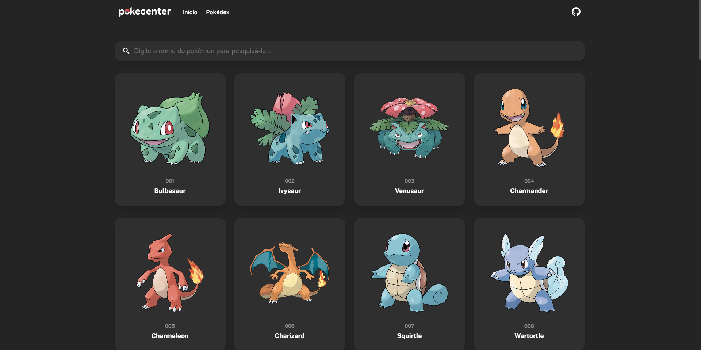

<a href="https://github.com/dngadelha/pokecenter"></a>

# Pokecenter

_Capture Pókemons pelo seu navegador_

[](https://github.com/dngadelha/pokecenter/blob/master/LICENSE)
[](https://github.com/dngadelha/pokecenter/stargazers)





## Características

- Cadastro de usuários de forma simples e rápida
- Capturar Pokémons (dados do usuário são salvos no servidor)
- Visualizar Pokédex com todos os Pokémons cadastrados
- Interface simples e amigável


## Estrutura do projeto

O Pokecenter é um projeto que utiliza o framework [Angular](https://angular.io/), [RxJS](https://rxjs.dev/) e [Node.js](https://nodejs.org/). Ele é dividido em 2 repositórios:

- [`@dngadelha/pokecenter`](https://github.com/dngadelha/pokecenter): Projeto que contém o front-end da aplicação.
- [`@dngadelha/pokecenter-backend`](https://github.com/dngadelha/pokecenter-backend): Projeto que contém o back-end da aplicação.


## Executando o código localmente

1. Certifique-se de possuir instalado o [Node.js LTS](https://nodejs.org/pt-br/download/)

2. Instale as dependências do projeto

```sh
npm install
```

3. Inicie o servidor de desenvolvimento:

```sh
ng serve
```

Após isto, você poderá acessar o Pokecenter em: [http://localhost:4200](http://localhost:4200)


## Sobre o Projeto

**Autor:** [Danilo Gadelha](mailto:dngadelha@outlook.com)

**Agradecimento pela Ilustração:** [Rica Diaz](https://www.ricadiaz.com/)


## Licença

    Pokecenter - Capture Pókemons pelo seu navegador
    Copyright (C) 2022  Danilo Gadelha e contribuidores

    This program is free software: you can redistribute it and/or modify
    it under the terms of the GNU General Public License as published by
    the Free Software Foundation, either version 3 of the License, or
    (at your option) any later version.

    This program is distributed in the hope that it will be useful,
    but WITHOUT ANY WARRANTY; without even the implied warranty of
    MERCHANTABILITY or FITNESS FOR A PARTICULAR PURPOSE.  See the
    GNU General Public License for more details.

    You should have received a copy of the GNU General Public License
    along with this program.  If not, see <http://www.gnu.org/licenses/>.


    The "Pokémon" trademark is copyright (c) 2022 Pokémon. (c) 1995 - 2022
    Nintendo/Creatures Inc./GAME FREAK inc. TM, (c) Nintendo.

